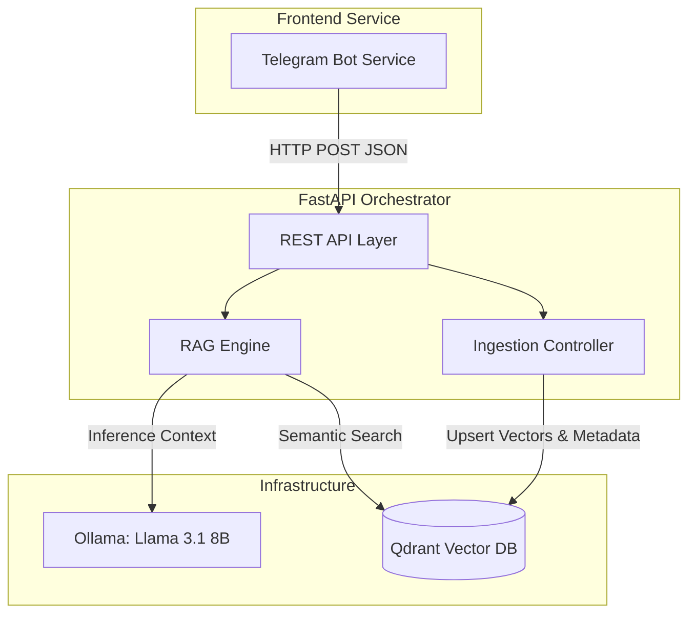
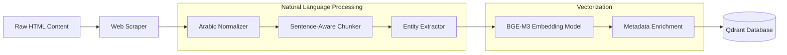

# Arabic RAG System: Middle East Intelligence Platform

## 1. Project Overview

The Arabic Retrieval-Augmented Generation (RAG) System is a specialized, microservices-based intelligence platform designed to aggregate, process, and query localized Arabic news and contextual data. The core problem this system addresses is the fragmentation and structural inconsistency of regional Arabic news sources, coupled with the computational challenge of maintaining high-accuracy semantic retrieval in a morphologically rich language. 

By leveraging advanced embedding models, metadata pre-filtering, and localized Large Language Models, the platform provides users with highly accurate, contextually grounded answers to complex geopolitical and economic inquiries. The system is engineered with domain-driven boundaries, ensuring deployability and seamless extensibility for future Knowledge Graph integration.

## 2. Key Features

*   **Semantic Arabic Search:** Utilizes high-dimensional embeddings optimized for Arabic text to ensure precise context retrieval.
*   **Deterministic Metadata Pre-Filtering:** Enforces region and category constraints at the vector database level prior to semantic search, guaranteeing strict contextual boundaries and reducing hallucination overhead.
*   **Asynchronous Microservices Architecture:** Fully decoupled backend and frontend services communicating exclusively via RESTful contracts.
*   **Automated Entity Extraction:** Identifies and tags Named Entities (Locations, Organizations, Persons) during the ingestion phase to seed future Knowledge Graph structures.
*   **Arabic Morphological Normalization:** Standardizes orthographic variations (e.g., Alef/Tashkeel normalization) to improve vector distance consistency.
*   **Stateless Telegram Interface:** Provides a lightweight, accessible frontend utilizing asynchronous I/O and state machines for query routing.

## 3. System Architecture

The system employs a layered microservices architecture prioritizing separation of concerns and independent scalability. The backend service is strictly responsible for orchestration, embedding, and inference, while the frontend handles user session management and interface rendering. 



### Architectural Decisions
*   **Microservices vs. Monolith:** Decoupling the bot framework from the RAG engine ensures that the computationally heavy inference tier can scale independently of the I/O-bound client tier.
*   **Local Containerization:** The initial deployment strategy targets local Docker environments to maintain data privacy and eliminate cloud-provider latency during the development lifecycle.
*   **Pre-Filtering vs. Post-Filtering:** Filtering vectors by metadata before nearest-neighbor calculation ensures deterministic context bounding, a critical requirement for accurate RAG applications.

## 4. Technology Stack

*   **FastAPI (Backend Orchestration):** Selected for its high-performance asynchronous execution and native OpenAPI schema generation via Pydantic. It enforces strict type contracts across service boundaries.
*   **Qdrant (Vector Database):** Chosen for its robust payload indexing capabilities, which allow highly efficient metadata filtering (Region, Category) alongside HNSW-based vector similarity search.
*   **Ollama with Llama 3.1 8B (Inference):** Provides local, containerized execution of state-of-the-art LLMs. Selected to eliminate external API dependencies and reduce latency.
*   **BAAI/bge-m3 (Embeddings):** A multilingual embedding model chosen for its superior performance on Arabic semantic similarity tasks, mapping text into a 1024-dimensional vector space.
*   **aiogram (Client Interface):** An asynchronous framework for the Telegram Bot API, selected for its efficient event-loop management and robust Finite State Machine (FSM) implementation.
*   **CAMeL Tools (NLP Processing):** Utilized for specialized Arabic Natural Language Processing tasks, specifically Named Entity Recognition (NER) and text normalization.

## 5. Data Flow / Processing Pipeline

The data ingestion lifecycle transforms unstructured HTML into queryable, semantically rich vector embeddings.



**Pipeline Stages:**
1.  **Ingestion:** Scrapers target specific regional domains (e.g., Al Jazeera) enforcing UTF-8 encoding.
2.  **Normalization:** Removal of diacritics (Tashkeel), unification of Alef variations, and whitespace standardization.
3.  **Chunking:** Text is split into 500-token segments with a 50-token overlap, strictly respecting sentence boundaries to preserve semantic context.
4.  **Extraction:** Pattern-based and NER-driven extraction of Persons, Organizations, and Locations.
5.  **Vectorization & Storage:** Chunks are embedded and stored alongside structured JSON metadata.

## 6. Project Structure

The repository is structured to enforce architectural boundaries and facilitate continuous integration.

```text
/Arabic-RAG
├── backend/                   # Core reasoning and data management service
│   ├── app/
│   │   ├── core/              # Configuration, environment parsing, and system constants
│   │   ├── models/            # Pydantic domain models and API contracts
│   │   ├── routers/           # FastAPI route definitions and endpoint handlers
│   │   └── services/          # Business logic (RAG Engine, Ingestion Pipeline)
│   ├── scripts/               # CLI utilities for data seeding and verification
│   └── pyproject.toml         # Build system and dependency management
├── bot/                       # Client presentation service
│   └── app/
│       ├── client/            # Asynchronous HTTP client for backend communication
│       └── handlers/          # Telegram message routing and state transitions
└── docker-compose.yml         # Multi-container orchestration definition
```

## 7. API Design

The backend exposes a strictly typed RESTful API. Endpoints are documented dynamically via Swagger/OpenAPI.

**Visual Reference:**
*[Placeholder: High-resolution dark-mode screenshot of the Swagger UI demonstrating the /api/v1/query endpoint and JSON schemas]*

### Primary Endpoint Contract

`POST /api/v1/query`

**Request Body (JSON):**
```json
{
  "question": "ما هو تأثير التطورات الأخيرة على الاقتصاد الإقليمي؟",
  "filters": {
    "region": "Middle East",
    "category": "Economy"
  },
  "top_k": 3
}
```

**Response Body (JSON):**
```json
{
  "answer": "تشير التقارير إلى أن التطورات الأخيرة قد أثرت بشكل مباشر على...",
  "sources": [
    {
      "url": "https://example.com/article/123",
      "title": "تحليل اقتصادي إقليمي",
      "region": "Middle East"
    }
  ],
  "entities_found": ["الاقتصاد الإقليمي"],
  "latency_ms": 412
}
```

**Visual Reference:**
*[Placeholder: Dark-mode screenshot of the Telegram Client application showing a multi-turn conversation and formatted markdown responses]*

## 8. Engineering Decisions

*   **Sentence-Boundary Chunking:** Naive character-count chunking fractures context, significantly degrading RAG performance. Implementing sentence-aware splitting ensures that logical statements remain intact within the vector space.
*   **Entity Payload Storage:** Extracting and storing entities in the vector payload during ingestion incurs an upfront computational cost but eliminates the need for expensive, on-the-fly extraction during the retrieval phase, paving the way for immediate Graph queries.
*   **Singleton HTTP Client:** The bot service utilizes a singleton `aiohttp` session pool. Opening and closing HTTP connections per message would introduce unacceptable latency at scale.
*   **Editable Mode Installations:** For development, the backend is installed via `pip install -e .` to ensure proper path resolution across the `app` module without relying on fragile `PYTHONPATH` modifications.

## 9. Setup and Installation

### Prerequisites
*   Docker Engine & Docker Compose
*   Python 3.10+ (for local development)

### Deployment (Containerized)
The entire infrastructure, including databases and inference engines, is orchestrated via Docker Compose.

```bash
# Clone the repository
git clone <repository_url>
cd Arabic-RAG

# Configure environment variables
cp .env.example .env
# Edit .env with required keys (e.g., TELEGRAM_BOT_TOKEN)

# Build and start the cluster
docker-compose up --build -d

# Initialize the LLM (Requires initial pull)
docker exec ollama ollama pull llama3.1:8b
```

### Local Development Setup
```bash
# Backend Setup
cd backend
python -m venv venv
source venv/bin/activate
pip install -e .
pip install -r requirements-dev.txt

# Start Development Server
uvicorn app.main:app --reload --port 8000
```

## 10. Testing and Validation

*   **Unit Testing Framework:** `pytest` configured with `pytest-asyncio` for asynchronous endpoint and handler validation.
*   **System Verification:** A dedicated utility (`scripts/verify_system.py`) executes end-to-end health checks across the network, validating vector database connectivity, LLM responsiveness, and API integrity prior to traffic routing.
*   **Static Analysis:** Enforced via `mypy` for strict type checking and `flake8` for architectural linting.

## 11. Results / Performance

*[Placeholder: Performance metrics table displaying P95 latency for embedding generation, vector retrieval, and LLM inference]*

*[Placeholder: Accuracy benchmark chart comparing general RAG vs. metadata-filtered RAG against regional validation datasets]*

## 12. Continuous Integration / Continuous Deployment (CI/CD)

The project utilizes a standard CI/CD pipeline (e.g., GitHub Actions) designed to enforce code quality and deployment safety.

**Pipeline Stages:**
1.  **Lint & Format:** Execution of `black` and `flake8` to ensure styling consistency.
2.  **Type Checking:** `mypy` analysis against the FastAPI backend to catch interface regressions.
3.  **Test Suite:** Execution of the `pytest` suite simulating Qdrant and Ollama responses.
4.  **Artifact Build:** Building Docker images for the Backend and Bot services and pushing them to a container registry upon merge to the main branch.

## 13. Future Improvements

*   **Knowledge Graph Implementation (Graph RAG):** Transitioning from pure semantic search to a hybrid Graph-Vector retrieval model. Entities currently extracted during ingestion will be mapped into a Neo4j database, allowing the system to traverse complex relationships (e.g., "Which organizations are linked to the locations mentioned in this document?") prior to LLM synthesis.
*   **Production Deployment target (AWS Infrastructure):** Migrating the Docker Compose architecture to Amazon Elastic Container Service (ECS) with AWS Fargate. Qdrant will be moved to a managed cluster, and the Ollama service will be transitioned to GPU-backed EC2 instances or Amazon Bedrock to support production-scale inference loads.
*   **Authentication & Authorization:** Implementation of JWT-based authentication for the REST API and role-based access control (RBAC) to secure programmatic access.